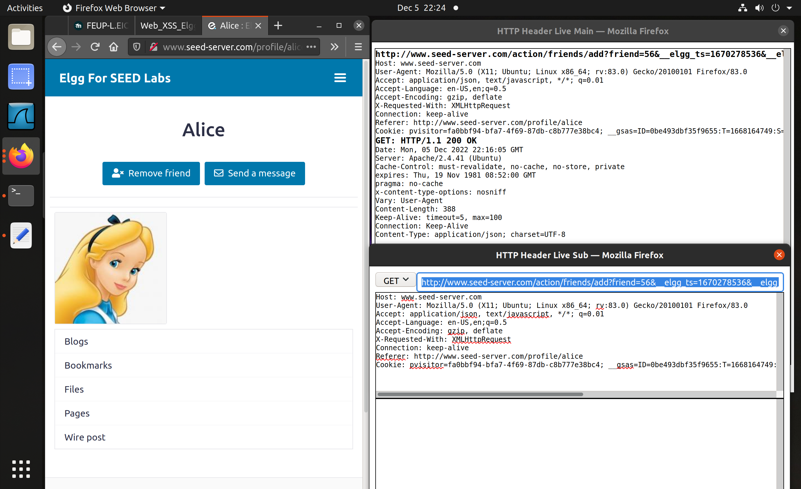

# **Week 10** 

## **Task 1**

- The objective of this task is to embed a JavaScript program in your Elgg profile
- This task gives the code for triggering an alert message displaying ‘XSS’ whenever a user views Samy’s profile

---

## **Task2**

- When another user views Samy's profile, the user’s cookies will be displayed in the alert window. This can be done by adding some additional code to the JavaScript program in the previous task.

---

## **Task3**

- In this task, Samy wants to steal Alice's cookie. To accomplish this, we used a new script in Samy's profile

- This script will send an HTTP GET request to the Attacker
machine's IP address at port location 5555. The Attacker machine needs to have a server listening on this port in order to receive the data (the cookie) being sent to that port, we used netcat to setup the server

- In Alice's account, after visiting Samy's profile we got access to Alice's session cookie

- "Elgg%3Da20fc9vnknobsdsrgl5r6brg5r"

---

## **Task4** 

- Firefox’s web development network tool can be used to view the HTTP request that is sent
- We used that request to alter the JavaScript code and changed it to Sammy's guid (59), because we want to make someone Sammy's friend

- After this, we pasted the script in Sammy's profile

- In Alice's account, after visiting Samy's profile, Samy gets added to her friends list

	

