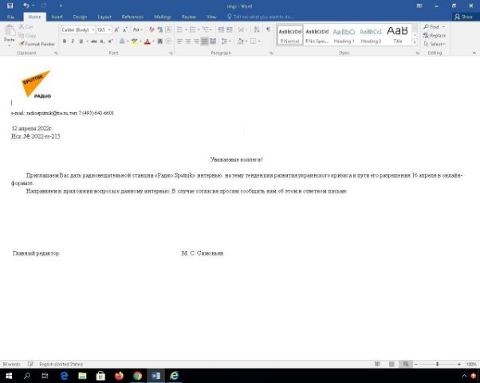

# [CVE-2022-30190](https://cve.mitre.org/cgi-bin/cvename.cgi?name=CVE-2022-30190) **- Follina**

**Identification**-(descrição geral da vulnerabilidade, incluindo aplicações/sistemas operativos relevantes)

“Follina“ sees a word document using a remote template feature to retrieve an HTML File from a remote server,and by using an ms-msdt MSProtocol URI scheme it can execute a PowerShell.

Which versions are vulnerable?

Office 2013, 2016, 2019, 2021, and som e versions of Office included with a 

Microsoft 365 license are subject to this vulnerability on both Windows 10 and Windows 11.

**Cataloguing** (o que se sabe sobre o seu reporting, quem, quando, como, bug-bounty, nível de gravidade, etc.) 

On May 27, 2022, on Twitter nao\_sec, there was information about a malicious Microsoft Word document that uses the Microsoft Support Diagnostic Tool (ms-msdt protocol) to run Windows PowerShell code. Two days later, [Kevin Beaumont](https://medium.com/@networksecurity?source=post_page-----1a47fce5629e--------------------------------) found a way to exploit this vulnerability.

Quoting Kevin, “I’m calling it Follina because the spotted sample on the file references 0438, which is the area code of Follina in Italy.”

“The official Follina vulnerability logo, carefully made in Microsoft Paint”

Back in April 2022, a file themed “invitation for an interview” with Sputnik Radio targeting a user in Russia, was uploaded to [VirusTotal](https://www.virustotal.com/gui/file/710370f6142d945e142890eb427a368bfc6c5fe13a963f952fb884c38ef06bfa/detection/f-710370f6142d945e142890eb427a368bfc6c5fe13a963f952fb884c38ef06bfa-1649756467).

This document directly exploits Follina vulnerability. It was reported to Microsoft, who decided it wasn’t a security issue.

Later in May 30th, in a [CVE](https://msrc.microsoft.com/update-guide/en-US/vulnerability/CVE-2022-30190) report by Microsoft Corporation, this vulnerability was rated a 7.8 score due to a High rating in each CIA category (Confidentiality, Integrity and Availability).

In addition, this vulnerability was rated a 9.3 score by [NVD](https://nvd.nist.gov/vuln/detail/CVE-2022-30190).

**Exploit** (descrever que tipo de exploit é conhecido e que tipo de automação existe, e.g., no Metasploit) 

Follina delivers remote code execution (RCE) attacks that allows an attacker to remotely execute malicious code on a computer.The impact of an RCE vulnerability can go from a simple malware execution to an attacker gaining full control over a compromised machine.

An attacker who successfully exploits the Follina vulnerability can run arbitrary code with the privileges of the calling application. The attacker can then install programs, view, change, or delete data, or create new accounts in the context allowed by the user's rights.

**Attacks** (descrever relatos de utilização desta vulnerabilidade para ataques bem sucedidos e/ou potencial para causar danos) 

China-linked threat actor TA413 has started exploiting the recently discovered “Follina” zeroday vulnerability (CVE-2022-30190) in a campaign targeting the international Tibetan community. TA413 was previously associated with LuckyCat and ExileRAT, and is believed to have been active since at least 2012. 

The group is known to pursue targets associated with Tibet in line with China’s strategic interests in the region. Mirroring exploitation demonstrations shared by the security community, TA413 is exploiting “Follina” to execute malicious code remotely using msdt processes launched when victims either open or preview Word documents distributed within ZIP archives. 

To lure recipients, the campaign impersonates the Women Empowerment Desk of the Central Tibetan Administration.

