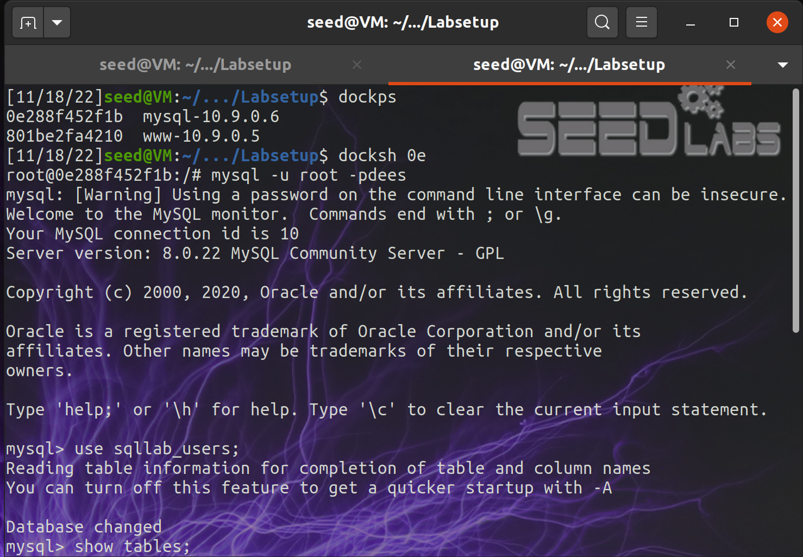
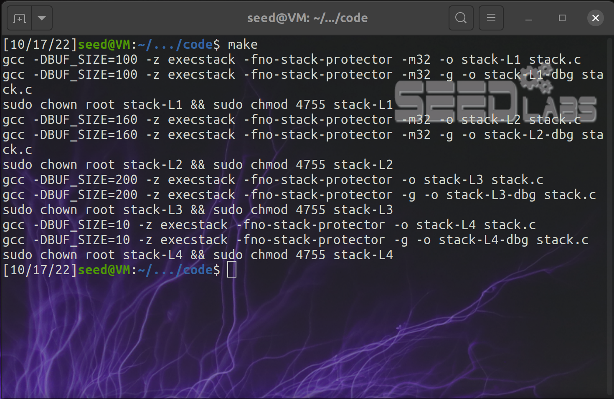
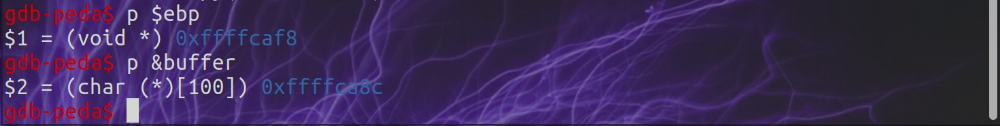

# **Week 5** 

## **Task 1**

- compiled and ran the programs
- both gave us access to the shell

---

## **Task2**

- used make to compile the program, which turned off some protections set by default

---

## **Task3**

- created a badfile
- opened the debug file for stack-L1 in gdb to gather the information needed

- set a break point at function bof() using 'b bof' and ran it

- get the ebp and the adress of the buffer

- changed the variables in the python script

	- start = 517 - len(shellcode) = 490
	- ret = &buffer + 200 = 0xffffca8c + 200
	- offset = $ebp - &buffer + 4 = 0xffffcaf8 - 0xffffca8c + 4 = 112
	

- Finally, we ran the exploit and gained access to the shell

	

