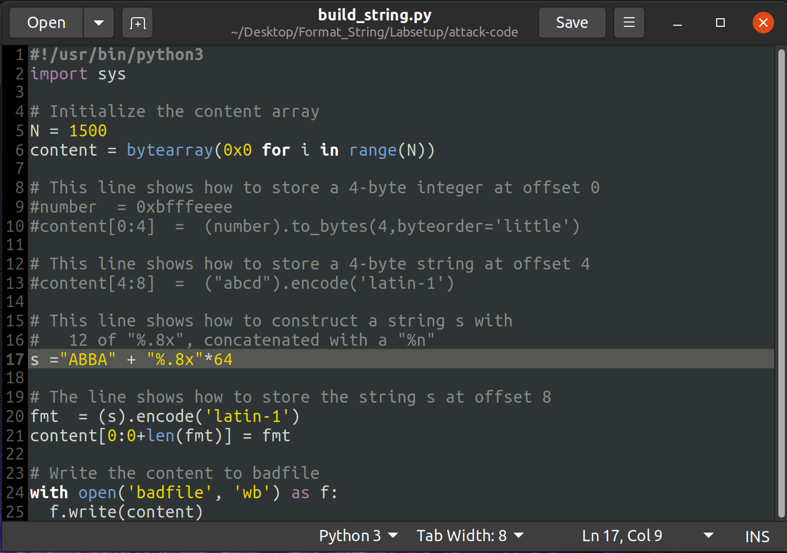

# **Week 6** 

## **Task 1**

- Ran the build_string.py program to create the badfile that we later used to crash the vulnerable server. 

---

## **Task2**

### **A**

- To print the first 4 bytes of our input we need to add "%8x" to find out the memory address of the stack values
- We used ABBA (41424241) as our 4 characters
 

### **B**

- To print out the secret message (heap data), we used the address which the server prints out as the "The secret message's address"
- We also changed the "s" line in the file so that the inputs goes directlu to the 64th position in the stack
 

---

## **Task3**

### **A**

- This time we used the "The target variable's address" instead of the secret message one

### **B**

- We know that 0x5000 is 20480
- The buffer size only allocates 1500 bytes so we had to include in the format string the specifier %x with a width of 20475 

	

