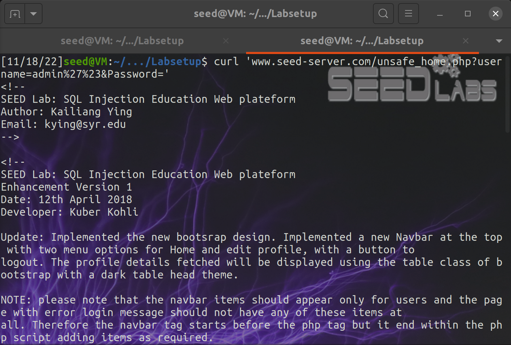
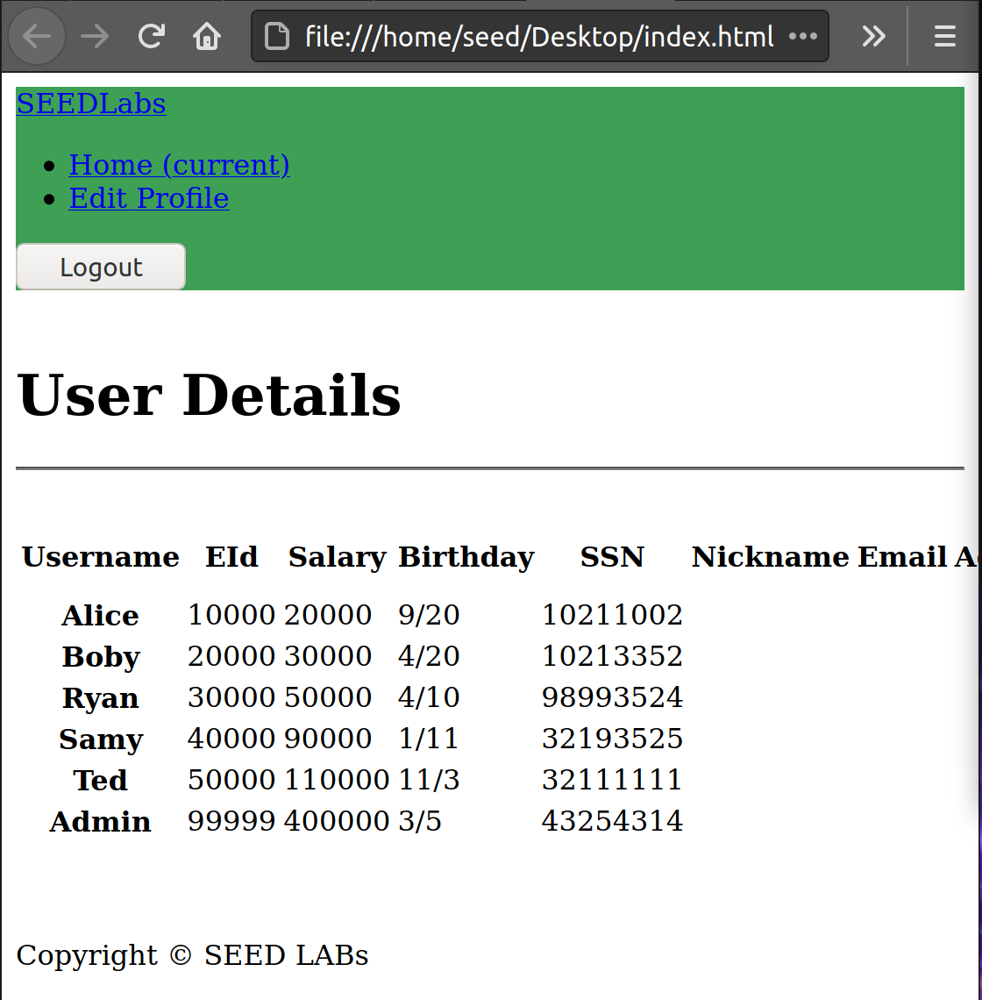

# **Week 7** 

## **Task 1**

- We logged into the MySql container using the credentials given

- Loaded the exisiting database

- Used a SQL command to print all the profile information of the employee Alice

---

## **Task2**

### **2.1**

- Exploiting the Sql injection vulnerability, we were able to login as administrator
-"admin'#" means is username = admin and we commented the rest of the query, bypassing the password protection.

### **2.2**

- Did the same thing that we did on task 1 but from the terminal, and had to encode the special characters that we used on the username

- Which gaves this html that we ran on the browser

### **2.3**

- couldn't insert into the table because mysql has a default protection against some operations

- the attack did not work because the API does not allow for multiple queries to run in the database server.

---

## **Task3**

### **3.1**

- To raise Alice's salary we logged into her account and entered the Edit-Profile page

- We set a nickname and next to it we added ",salary='500000" 

### **3.2**

- To set Boby's salary to 1 we logged back into Alice's account and entered Edit-Profile page

- We set a nickname again and next to it we add "', salary=1 WHERE Name='Boby';#"

### **3.3**

- We had access to the encrypted passwords and we knew it uses SHA 1, so we used a program to decrypt Boby's password

- After that, we just logged into Boby's account and changed his password

	

